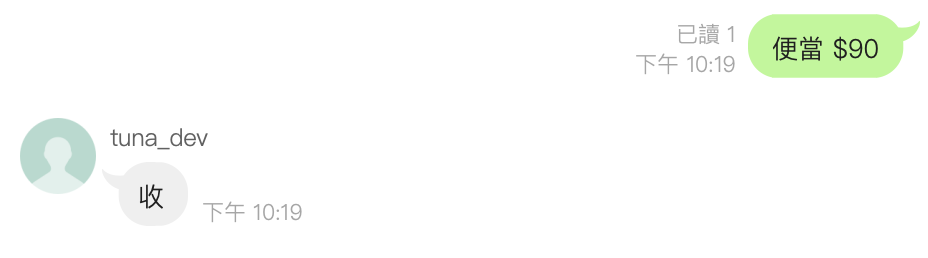
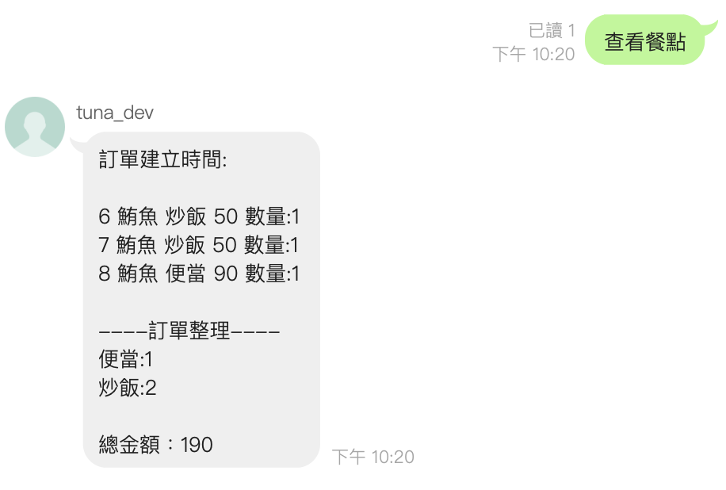
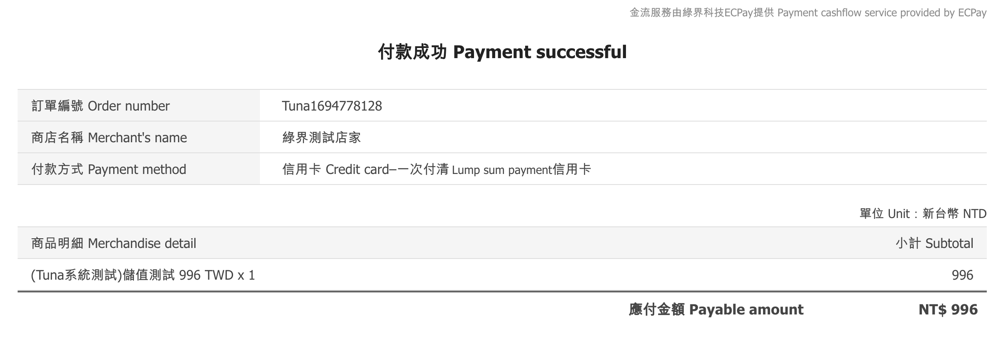
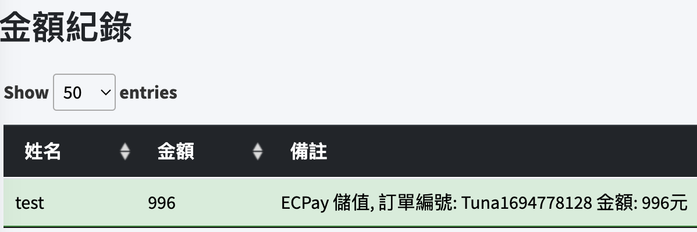

# 餐點整合系統
- 網址：https://demo.tunagood.site/

註冊邀請碼：DEMOCODE
## 功能:
### 帳號
1. 支援記住我功能
2. 支援 Google 登入

### 綠界儲值
1. [x] 支援綠界儲值

### 點餐
1. 點餐狀態顯示
2. 若是新餐點，點餐後自動新增餐點到該餐廳
3. Web端點餐直接選擇餐點，不用自己輸入
4. 點餐錯誤在結算時可以自動補金額
5. 結單自動扣款
6. 支援line bot點餐(需綁定line id才可點餐)

### 截圖
#### Line 點餐

#### 綠界儲值

## 參考資料
- Laravel最佳實踐 - https://github.com/alexeymezenin/laravel-best-practices/blob/master/traditional-chinese.md
